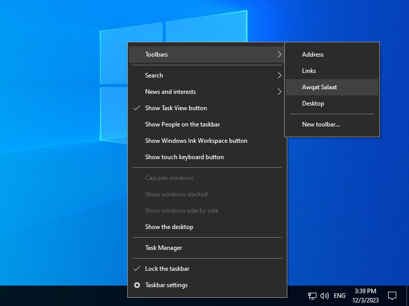
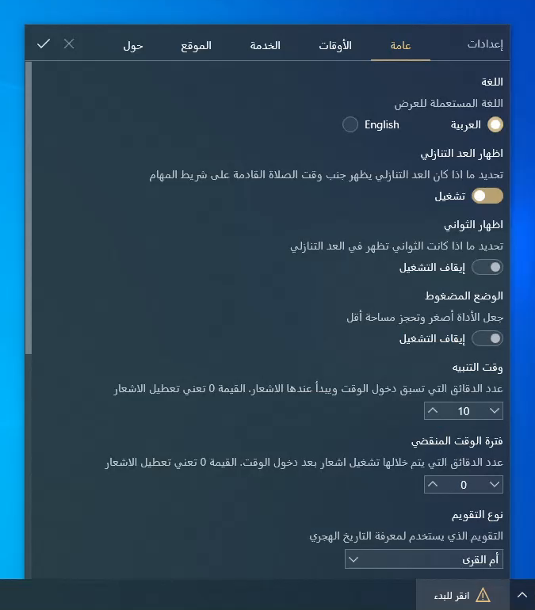

English version is available [here](README.md)
# أداة أوقات الصلاة

هذه أداة إسلامية بسيطة خاصة بنظام ويندوز التي تعرض وقت الصلاة القادمة إلى جانب العد العكسي على شريط المهام وهذا لمساعدة المستعمل على تتبع أوقات الصلوات.

الأداة تستطيع عرض أوقات الصلوات الخاصة باليوم بأكمله وتقوم بالتحديث تلقائيا لعرض أوقات اليوم الموالي عندما يدخل وقت آخر صلاة (العشاء).

حاليا الأداة تعتمد على خدمة واجهة برمجة التطبيقات (Prayer Times API) المقدمة من طرف منصة الباحث الإسلامي للحصول على أوقات الصلوات إعتمادا على إعدادات المستخدم.

> [!caution]
> الغاية الوحيدة من هذه الأداة هو الحصول على فكرة حول ما إذا كانت الصلاة القادمة قريبة أم لا بطريقة بسيطة دون الحاجة إلى الضغط أو فتح أي شيء.
 فالبرغم من أن أغلب الأوقات المقدمة من طرف خدمة واجهة برمجة التطبيقات هي تقريبا دقيقة إلا أنه لا يمكن ضمان حصول ذلك دائما، خاصة مع صلاة المغرب.
 لذلك **لا تعتمد** على الأداة للحصول على الوقت المضبوط خاصة لأداء الشعائر كالصيام وإقامة الصلوات مباشرة عند دخول وقتها.

## المنصات المدعومة

أوقات الصلاة هي أداة خاصة بنظام ويندوز التي تستفيد من ميزة اسمها *Desk Band*.
هذه الميزة قديمة وقد تم التخلي عنها وإزالتها بالكلية من نظام ويندوز 11 ولذلك فإن نظام ويندوز 11 غير مدعوم.
ومع ذلك فإن النسخ الأقدم (ويندوز 7، 8، 8.1 و10) هي مدعومة نظريا لكن الأداة صممت خصيصا لنظام ويندوز 10 ولم يتم تجريبها على النسخ الأقدم.

أيضا يرجى الانتباه إلى أنك في حال اخترت استعمال الأداة على أنظمة ويندوز 7/8/8.1 فتأكد من تثبيت الخط [Segoe MDL2 Assets](https://aka.ms/SegoeFonts).

## التثبيت

اذهب إلى صفحة [الإصدارات](https://github.com/Khiro95/Awqat-Salaat/releases/latest) وقم بتحميل برنامج التثبيت الموافق لهندسة نظام التشغيل لديك.

> [!warning]
> إذا قمت باختيار برنامج التثبيت نسخة `x86` بينما لديك نظام التشغيل بهندسة `x64` فإن الأداة لن يتم تثبيتها بشكل صحيح.

بعد تحميل برنامج التثبيت قم بالضغط عليه مرتين لتثبيت الأداة.

من المتوقع أن الأداة لن تظهر بعد نهاية التثبيت لذا يتعين عليك تفعيلها يدويا. إليك الخطوات:
- قم بالضغط بالزر الأيمن على شريط المهام ثم مرر المؤشر فوق **أشرطة الأدوات**. لأسباب مجهولة فإن اسم الأداة سيكون غائبا من قائمة أشرطة الأدوات ولهذا يجب عليك تكرار هذه الخطوة.

- في المرة الثانية سيظهر اسم الأداة لذا قم بالضغط عليه لتفعيل الأداة.

- الآن يفترض أن تظهر الأداة على شريط المهام. قم بالضغط عليها لإظهار لوحة الإعدادت ثم قم بإدخال المعطيات الضرورية ثم اضغط على ✔️ لحفظ التغييرات.
  

> [!tip]
> تأكد من تفقد الخيارات الموجودة بالنسبة لـ**طريقة الحساب** بما أنه قد يكون هناك خيار لبلدك وإلا فاترك الخيار الافتراضي. في النسخ المستقبلية قد يتم دعم الإعدادت المخصصة لطريقة الحساب.

## عرض

هنا بعض لقطات الشاشة لأداة أوقات الصلاة لكلا المظهرين الداكن والفاتح.
> [!note]
> المظهر دائما يتماشى مع مظهر النظام على ويندوز 10.

## الإنشاء

لإنشاء أداة أوقات الصلاة وبرنامج المعاينة تحتاج إلى الآتي:
- .NET Framework 4.7.2 development tools

إضافة إلى ذلك، لإنشاء برنامج التثبيت تحتاج حزمة تطوير البرامج الآتية:
- Wix Toolset Sdk v4.0.3

## ملاحظات

- الأداة تقوم بتخزين مؤقت لكل أوقات الشهر الحالي التي يتم الحصول عليها من خدمة واجهة برمجة التطبيقات وهذا لكي تعمل الأداة في وضع عدم الاتصال بالانترنت.
- برنامج المعاينة يستعمل لأغراض التطوير فقط.
- التاريخ الهجري الذي يعرض على الأداة هو مزود من طرف مشغل البرنامج (runtime (.NET Framework)) وهذا التاريخ مبني على تقويم *أم القرى* ولهذا فقد لا يكون مطابقا في كل مكان.

## عرفان

- [مكتبة CSDeskBand:](https://github.com/dsafa/CSDeskBand) مكتبة تبسط إنشاء أدوات DeskBand باستخدام تكنولوجيا WinForms أو WPF.
- [الباحث الإسلامي:](http://www.islamicfinder.us/index.php/api) توفر هذه المنصة خدمة واجهة برمجة تطبيقات بسيطة للحصول على أوقات الصلوات.