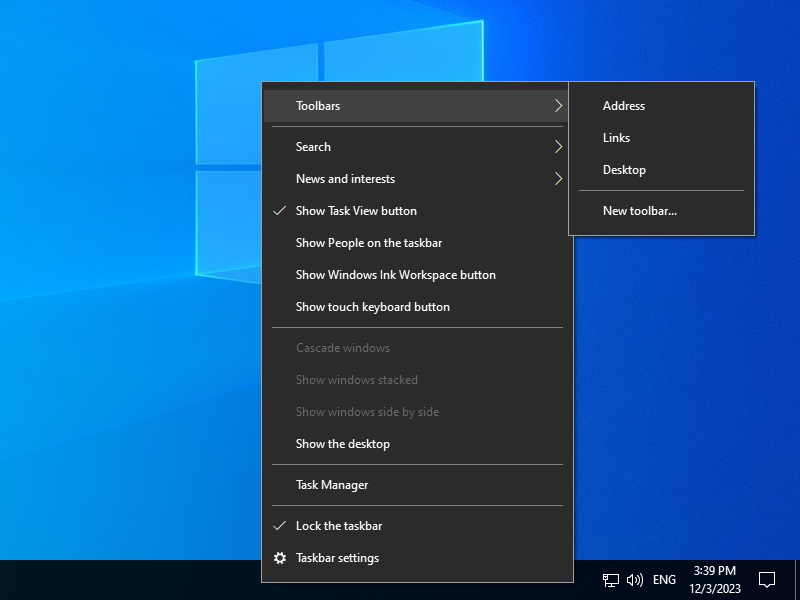
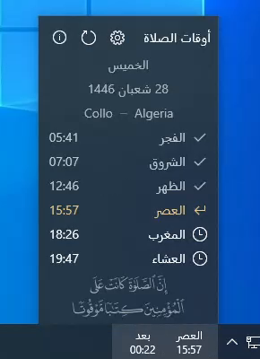
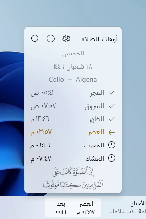
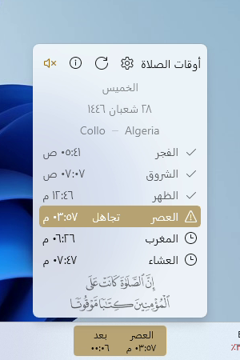
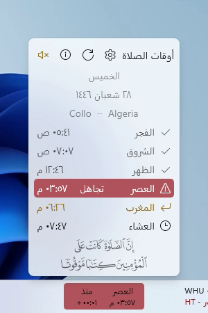

English version is available [here](README.md)
# أداة أوقات الصلاة 

هذه أداة إسلامية بسيطة خاصة بنظام ويندوز والتي تعرض وقت الصلاة القادمة إلى جانب العد العكسي على شريط المهام وهذا لمساعدة المستعمل على تتبع أوقات الصلوات.

الأداة تستطيع عرض أوقات الصلوات الخاصة باليوم بأكمله وتقوم بالتحديث تلقائيا لعرض أوقات اليوم الموالي عندما يدخل وقت آخر صلاة (العشاء).

الأداة تدعم أيضا الإشعار المرئي عندما يقترب وقت الصلاة القادمة من حد قابل للضبط.

حاليا الأداة تستعمل خدمتين للحصول على أوقات الصلوات إعتمادا على إعدادات المستخدم:
- [واجهة برمجة التطبيقات (Prayer Times API)  من طرف منصة الباحث الإسلامي](http://www.islamicfinder.us/index.php/api)
- [واجهة برمجة التطبيقات (Prayer Times API)  من طرف منصة الأذان](https://aladhan.com/prayer-times-api)

> [!caution]
> الغاية الوحيدة من هذه الأداة هو الحصول على فكرة حول ما إذا كانت الصلاة القادمة قريبة أم لا بطريقة بسيطة دون الحاجة إلى الضغط أو فتح أي شيء.
 فالبرغم من أن أغلب الأوقات المقدمة من طرف خدمات واجهة برمجة التطبيقات هي تقريبا دقيقة إلا أنه لا يمكن ضمان حصول ذلك دائما، خاصة مع صلاة المغرب.
 لذلك **لا تعتمد** على الأداة للحصول على الوقت المضبوط خاصة لأداء الشعائر كالصيام وإقامة الصلوات مباشرة عند دخول وقتها.

## المنصات المدعومة

أوقات الصلاة هي أداة خاصة بنظام ويندوز وهي متوفرة في شكلين: ***Deskband*** (Awqat Salaat) و ***WinUI*** (Awqat Salaat WinUI).
وإليكم مقارنة سريعة بين الشكلين فيما يخص التوافق:

| أوقات الصلاة WinUI | أوقات الصلاة | نظام التشغيل |
| --: | --: | --: |
| متوافق ✔ | غير متوافق ❌ | **ويندوز 11** |
| متوافق ✔⚠ | متوافق ✔ | **ويندوز 10** |
| غير متوافق ❌ | متوافق ✔ | **ويندوز 8/8.1** |
| غير متوافق ❌ | متوافق ✔ | **ويندوز 7** |

⚠ أداة أوقات الصلاة WinUI لا تدعم نسخ ويندوز 10 الأقدم من 1809.

### أوقات الصلاة (Deskband)

هذه الأداة تستفيد من ميزة اسمها *Desk Band* وهي ميزة قديمة قد تم التخلي عنها وإزالتها بالكلية من نظام ويندوز 11.
ومع ذلك فإن النسخ الأقدم (ويندوز 7، 8، 8.1 و10) مازالت تدعم هذه الميزة.

بالرغم من أن الأداة صممت خصيصا لنظام ويندوز 10، فإنه بدءا من النسخة 1.1 فإن الأداة متوافقة مع أنظمة ويندوز 7/8/8.1 وكل نسخ نظام ويندوز 10 مع وجود فروقات بسيطة في المظهر.

أيضا يرجى الانتباه إلى أنك في حال اخترت استعمال الأداة على أنظمة ويندوز 7/8/8.1 فتأكد من تثبيت [.NET Framework 4.7.2 Runtime](https://dotnet.microsoft.com/en-us/download/dotnet-framework/net472) إلى جانب الخط [Segoe MDL2 Assets](https://aka.ms/SegoeFonts).

### أوقات الصلاة WinUI 

هذه الأداة هي تطبيق عادي يعمل على ويندوز 11 وعلى ويندوز 10 1809 أو أحدث.
هذا التطبيق يسمح بجلب أداة أوقات الصلاة إلى نظام ويندوز 11 الذي لم يكن مدعوما في النسخ السابقة للأداة.

> [!note]
> بالرغم من أن التطبيق يمكن أن يعمل على نظام ويندوز 10 إلا أنه *لا ينصح به* بسبب محدوديته في بعض الجوانب كما هو مذكور في الأسفل، لذا يستحسن استعمال أداة deskband.

#### المتطلبات (غير ضرورية لنسخة متجر مايكروسوفت)

- [.NET Desktop Runtime 6](https://dotnet.microsoft.com/en-us/download/dotnet/6.0)
- [Windows App Runtime 1.5](https://learn.microsoft.com/en-us/windows/apps/windows-app-sdk/downloads)
> [!note]
> إذا ظهر لك خطأ حول عدم وجود Windows App Runtime بعد تثبيته، فقم بالذهاب إلى صفحة التحميل وقم بتحميل *Redistributable* بدلا من Installer، ثم افتح الأرشيف وقم بتثبيت الحزمة `MSIX\win10-x64 (or x86)\Microsoft.WindowsAppRuntime.DDLM.1.5.msix`

#### المحدوديات والمشاكل المعروفة
- الأداة يتم *إقحامها* داخل شريط المهام ولذلك فهي ليست جزءا منه.
- الأداة مركبة فوق محتوى شريط المهام ولذلك قد تحدث مشاكل التداخل عندما يصبح شريط المهام مكتظا.
- الأداة قد لا تستجيب لكل التغييرات التي تحصل في شريط المهام من أجل تحديث موقعها (بالإمكان عمل إعادة تموقع يدويا).
- الأداة لا يمكن إظهارها وإخفاءها من شريط المهام بنفسه. لكن تتوفر قائمة سياق وأيقونة علبة النظام من أجل التحكم في الأداة.
- المستكشف (Explorer) لن يدير الأداة ولذلك يجب تشغيلها خارجيا عند تشغيل نظام ويندوز. يمكن ضبط هذا الأمر في الإعدادات.
- على أجهزة 2-في-1، قد تحتاج إلى عمل إعادة تموقع يدوي للأداة بعد التبديل من/إلى وضع اللوحة.

## التثبيت

### من متجر مايكروسوفت

أداة أوقات الصلاة WinUI متوفرة على متجر مايكروسوفت.

### من منصة GitHub

اذهب إلى صفحة [الإصدارات](https://github.com/Khiro95/Awqat-Salaat/releases) وقم بتحميل برنامج التثبيت الموافق لهندسة نظام التشغيل لديك.

> [!warning]
> إذا قمت باختيار برنامج التثبيت نسخة `x86` بينما لديك نظام التشغيل بهندسة `x64` فإن الأداة لن يتم تثبيتها بشكل صحيح.

بعد تحميل برنامج التثبيت قم بالضغط عليه مرتين لتثبيت الأداة.

### الخطوات

***إذا اخترت أداة أوقات الصلاة WinUI فقم بتشغيل التطبيق واقفز إلى الخطوة 3.***

من المتوقع أن الأداة لن تظهر بعد نهاية التثبيت لذا يتعين عليك تفعيلها يدويا. إليك الخطوات:
1. قم بالضغط بالزر الأيمن على شريط المهام ثم مرر المؤشر فوق **أشرطة الأدوات**. لأسباب مجهولة فإن اسم الأداة سيكون غائبا من قائمة أشرطة الأدوات ولهذا يجب عليك تكرار هذه الخطوة.

  

2. في المرة الثانية سيظهر اسم الأداة لذا قم بالضغط عليه لتفعيل الأداة.

  
  
3. الآن يفترض أن تظهر الأداة على شريط المهام. قم بالضغط عليها لإظهار لوحة الإعدادت ثم قم بإدخال المعطيات الضرورية ثم اضغط على ✔️ لحفظ التغييرات.

  
> [!tip]
> تأكد من تفقد الخيارات الموجودة بالنسبة لـ**طريقة الحساب** بما أنه قد يكون هناك خيار لبلدك وإلا فاترك الخيار الافتراضي. في النسخ المستقبلية قد يتم دعم الإعدادت المخصصة لطريقة الحساب.

## عرض

### نظام ويندوز 10 (Deskband)

> [!note]
> المظهر دائما يتماشى مع مظهر النظام على ويندوز 10.

##### عادي

##### مضغوط

#### اشعار التذكير

#### اشعار الوقت المنقضي

### نظام ويندوز 11 (WinUI)

> [!note]
> المظهر دائما يتماشى مع مظهر النظام.

##### عادي

##### مضغوط

#### اشعار التذكير

#### اشعار الوقت المنقضي

## البناء

لبناء أداة أوقات الصلاة (Deskband) وبرنامج المعاينة تحتاج إلى الآتي:
- .NET Framework 4.7.2 development tools

لبناء أداة أوقات الصلاة WinUI تحتاج إلى الآتي:
- .NET SDK
- Windows App SDK

إضافة إلى ذلك، لبناء برامج التثبيت تحتاج حزمة تطوير البرامج الآتية:
- Wix Toolset Sdk v4.0.3

## سجل التغيرات

للاطلاع على التغييرات، تفقد سجل التغيرات [هنا](CHANGELOG.ar.md).

## ملاحظات

- الأداة تقوم بتخزين مؤقت لكل أوقات الشهر الحالي التي يتم الحصول عليها من خدمة واجهة برمجة التطبيقات وهذا لكي تعمل الأداة في وضع عدم الاتصال بالانترنت.
- برنامج المعاينة يستعمل لأغراض التطوير فقط.

## عرفان

- [مكتبة CSDeskBand:](https://github.com/dsafa/CSDeskBand) مكتبة تبسط إنشاء أدوات DeskBand باستخدام تكنولوجيا WinForms أو WPF.
- [مكتبة H.NotifyIcon:](https://github.com/HavenDV/H.NotifyIcon) مكتبة تبسط إنشاء أيقونات علبة النظام.
- [الباحث الإسلامي:](https://www.islamicfinder.us/index.php/api) توفر هذه المنصة خدمة واجهة برمجة تطبيقات بسيطة للحصول على أوقات الصلوات.
- [الأذان:](https://aladhan.com/prayer-times-api) توفر هذه المنصة خدمة واجهة برمجة تطبيقات مرنة للحصول على أوقات الصلوات.
- [خدمة Nominatim:](https://nominatim.org/) خدمة ترميز جغرافي مفتوحة المصدر.

## اتصال

للاستفسار أو التبليغ عن أية مشكلة، يرجى فتح [مسألة جديدة](https://github.com/Khiro95/Awqat-Salaat/issues/new) أو إرسال بريد الكتروني إلى khiro95.gh@gmail.com.

## سياسة الخصوصية

يمكن إيجاد التفاصيل [هنا](PRIVACY-POLICY.md) (متوفرة باللغة الانجليزية فقط حاليا).

## الترخيص

هذا المشروع مرخص بموجب بنود [ترخيص MIT](LICENSE).