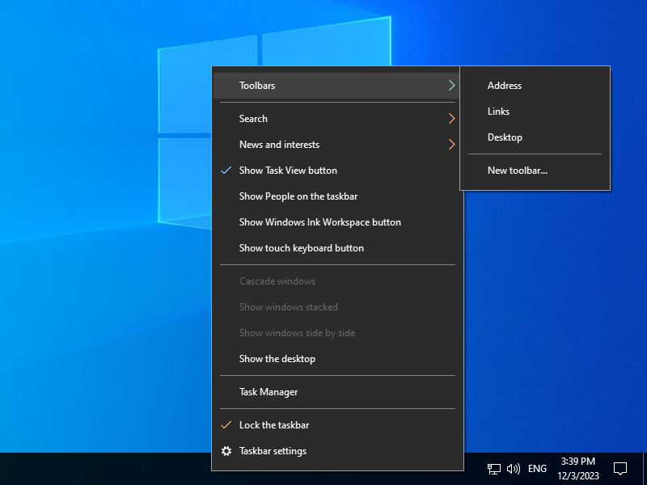
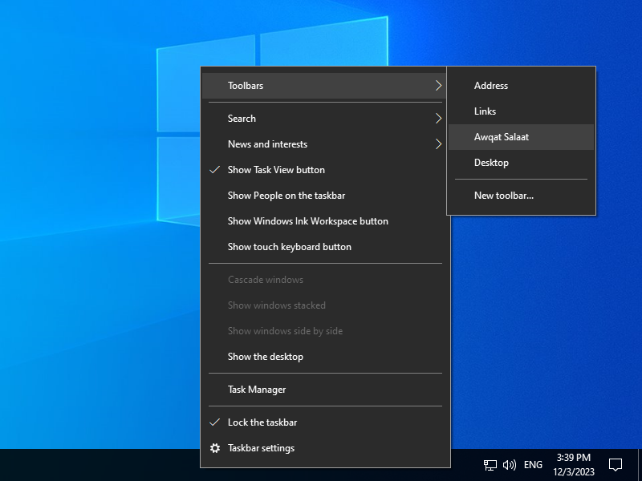
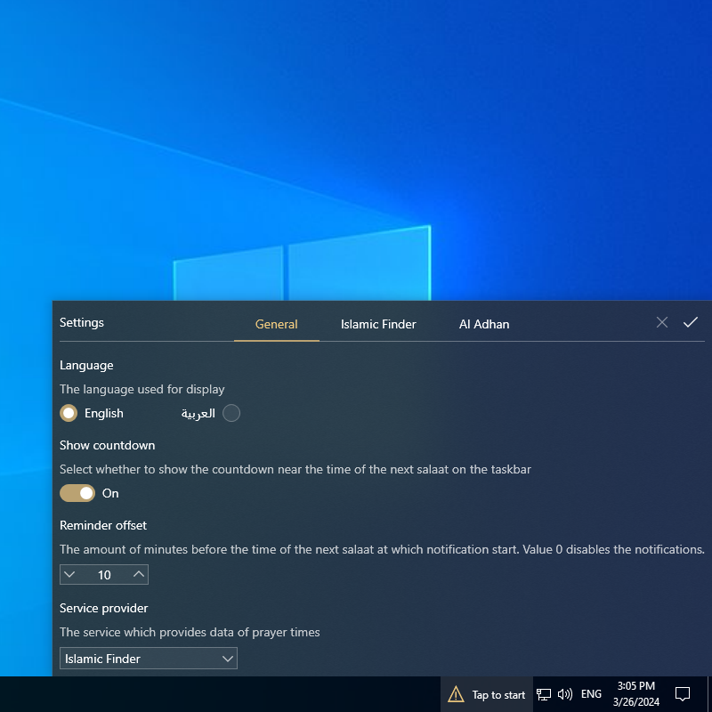
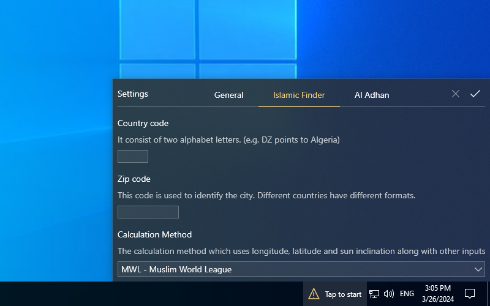
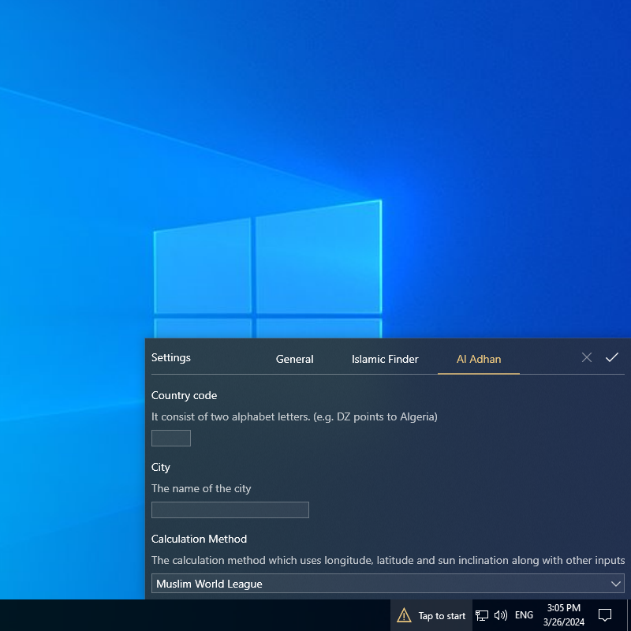
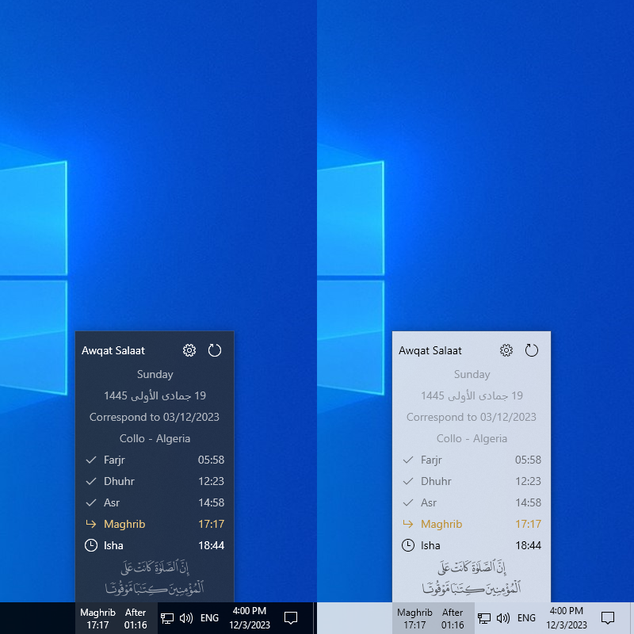

النسخة العربية متوفرة [هنا](README.ar.md)
# Awqat Salaat Widget 

This is a simple Islamic Windows widget that shows the time of the next prayer alongside a countdown, on the taskbar, in order to help the user keep tracking of prayers times.

The widget can show the prayers times of the whole day and update automatically, to show times of the next day, when the time of last prayer (Isha) has entered.

This widget support visual notification when the time of the next prayer becomes close to a certain configurable limit.

Actually, the widget uses two services to get the prayers times based on user settings:
- [Islamic Finder's Prayer Times API](http://www.islamicfinder.us/index.php/api)
- [Al-Adhan's Prayer Times API](https://aladhan.com/prayer-times-api)

> [!caution]
> The only purpose of this widget is to have an idea whether the next prayer is close or not in a simple way without having to click/open anything.
Although most prayers times provided by the APIs are almost precise, there is no guarantee that this will be always the case, especially for Maghrib prayer.
So **DON'T** rely on the widget to get the exact time, especially for performing rituals such as fasting or establishing prayers right after entering their times.

## Supported Platforms

Awqat Salaat is a *Windows* widget that takes advantage of a feature called *Desk Band*.
That's an old feature which has been deprecated and removed completely from Windows 11, thus Windows 11 is not supported.
However, the older vesions (Windows 7, 8, 8.1 and 10) are supported in theory but the widget was designed specifically for Windows 10.

The widget had been tested on Windows 7 Ultimate x64 and it's made compatible with it. Although there are some subtle visual differences, it's fully functional.

Starting from version 1.1, the widget is compatible with Windows 7/8/8.1 and all versions of Windows 10.

Also note that if you choose to use the widget on Windows 7/8/8.1 then make sure to install [.NET Framework 4.7.2 Runtime](https://dotnet.microsoft.com/en-us/download/dotnet-framework/net472) and the font [Segoe MDL2 Assets](https://aka.ms/SegoeFonts).

## Installation

Go to [Releases](https://github.com/Khiro95/Awqat-Salaat/releases) page and download the installer that matches your OS architecture.

> [!warning]
> If you choose the `x86` version of the installer while your OS is `x64`, then the widget won't install correctly.

After downloading the installer, double-click on it to install the widget.

It's expected that the widget will not appear after the installation finish, so you need to activate it manually. Here are the steps:

- Right-click on the taskbar then move the mouse over **Toolbars**. For unknown reasons, the widget name will be absent in the list of toolbars so you have to repeat this step again.

  
- In the second time, the widget name **Awqat Salaat** will appear so click on it to activate the widget.

  
- Now the widget should appear on the taskbar. Click on it to show settings panel then enter the necessary inputs and click on ✔️ to save changes.
  Note that you only need to configure the service you wish to use, unless you want both.
  
  
  
  
> [!tip]
> Make sure to check available options for **Calculation Method** since there can be one for your country; otherwise just leave the default one. Custom method might be supported in future versions of the widget as well.

> [!note]
> Actually, each service provide its own set of built-in calculation methods. In future versions, these methods may be unified.
## Showcase

Here some screenshots of Awqat Salaat widget for both dark and light theme.
> [!note]
> The theme always match system theme on Windows 10.

## Build

To build Awqat Salaat widget and the preview app, the following is needed:
- .NET Framework 4.7.2 development tools

In addition, to build the installer the following SDK is needed:
- Wix Toolset Sdk v4.0.3

## Changelog

### v2.0

- Add Al-Adhan's Prayer Times API.

### v1.1.3

- Show clearer error message when Islamic Finder's Prayer Times API is down.

### v1.1

- Fix compatibility issues with Windows 7.

### v1.0

- Initial release.

## Notes

- The widget cache all the times of the current month, obtained from the API, so that it can work in offline mode.
- The preview app is used for development purposes only.
- The Hijri date shown in the widget is provided by the runtime (.NET Framework) and is based on *Um Al Qura* calendar, thus it may not match the exact date everywhere.

## Credits

- [CSDeskBand:](https://github.com/dsafa/CSDeskBand) A library that simplifies the creation of DeskBands using WinForms or WPF.
- [Islamic Finder:](http://www.islamicfinder.us/index.php/api) They provide a simple API for getting the prayers times.
- [Al-Adhan:](https://aladhan.com/prayer-times-api) They provide a flexible API for getting the prayers times.