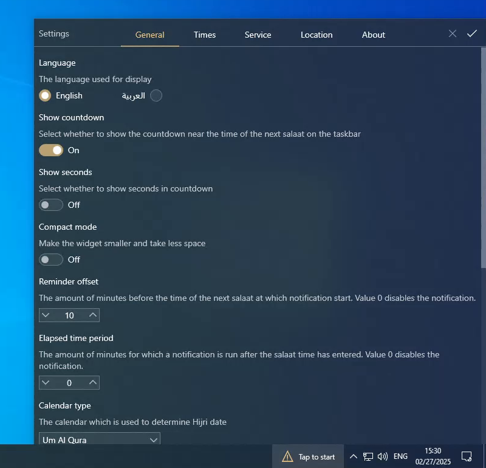
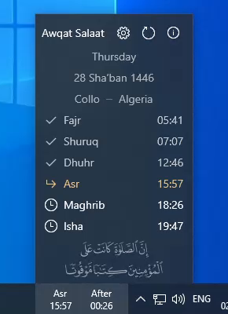
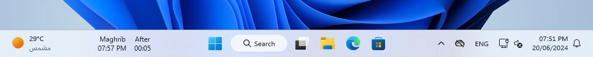
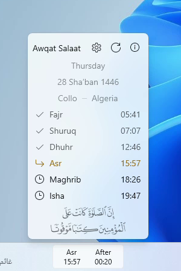
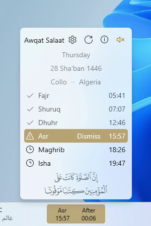
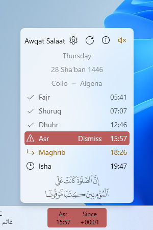

النسخة العربية متوفرة [هنا](README.ar.md)
# Awqat Salaat Widget 

This is a simple Islamic Windows widget that shows the time of the next prayer, alongside a countdown, on the taskbar in order to help the user keep tracking of prayers times.

The widget can show the prayers times of the whole day and update automatically, to show times of the next day, when the time of last prayer (Isha) has entered.

This widget support visual notification when the time of the next prayer becomes close to a certain configurable limit.

Actually, the widget uses two services to get the prayers times based on user settings:
- [Islamic Finder's Prayer Times API](http://www.islamicfinder.us/index.php/api)
- [Al-Adhan's Prayer Times API](https://aladhan.com/prayer-times-api)

> [!caution]
> The only purpose of this widget is to have an idea whether the next prayer is close or not in a simple way without having to click/open anything.
Although most prayers times provided by the APIs are almost precise, there is no guarantee that this will be always the case, especially for Maghrib prayer.
So **DON'T** rely on the widget to get the exact time, especially for performing rituals such as fasting or establishing prayers right after entering their times.

## Supported Platforms

Awqat Salaat is a *Windows* widget that is available in two forms: ***Deskband*** (Awqat Salaat) and ***WinUI*** (Awqat Salaat WinUI).
Here is a quick compatibility comarison between both forms:

| Operating System | Awqat Salaat | Awqat Salaat WinUI |
| --- | --- | --- |
| **Windows 11** | Incompatible ❌ | Compatible ✔ |
| **Windows 10** | Compatible ✔ | Compatible ✔⚠ |
| **Windows 8/8.1** | Compatible ✔ | Incompatible ❌ |
| **Windows 7** | Compatible ✔ | Incompatible ❌ |

⚠ Awqat Salaat WinUI is not supported on Windows 10 versions older than 1809.

### Awqat Salaat (Deskband)

This widget takes advantage of a feature called *Desk Band* which is an old feature and has been deprecated and removed completely from Windows 11.
However, the older vesions (Windows 7, 8, 8.1 and 10) still support this feature.

Although the widget was designed specifically for Windows 10, starting from version 1.1 the widget is compatible with Windows 7/8/8.1 and all versions of Windows 10 with some subtle visual differences on Windows 7/8/8.1.

Also note that if you choose to use the widget on Windows 7/8/8.1 then make sure to install [.NET Framework 4.7.2 Runtime](https://dotnet.microsoft.com/en-us/download/dotnet-framework/net472) and the font [Segoe MDL2 Assets](https://aka.ms/SegoeFonts).

### Awqat Salaat WinUI 

This widget is a regular app that can run on Windows 11 and on Windows 10 1809 or later.
This app bring Awqat Salaat to Windows 11 which wasn't supported in earlier versions of the widget.

> [!note]
> Although this app can run on Windows 10, it's *not recommended* due to the limitiations listed below, use deskband widget instead.

#### Requirements

- [.NET Desktop Runtime 6](https://dotnet.microsoft.com/en-us/download/dotnet/6.0)
- [Windows App Runtime 1.5](https://learn.microsoft.com/en-us/windows/apps/windows-app-sdk/downloads)
> [!note]
> If you get an error about missing Windows App Runtime after installing it, go to the download page and download *Redistributable* instead of Installer, open the zip
> and install the package `MSIX\win10-x64 (or x86)\Microsoft.WindowsAppRuntime.DDLM.1.5.msix`

#### Limitations & known issues

- The widget is *injected* into the taskbar, thus it's not a part of it.
- The widget overlap the taskbar content which can lead to overlapping issue when the taskbar become full.
- The widget may not respond to all changes in the taskbar to update its position (can be re-positioned manually).
- The widget cannot be shown/hidden from the taskbar itself. However, a context-menu and a system tray icon are available to control the widget.
- Explorer will not manage the widget so it has to be launched externally at Windows startup. This can be configured in Settings.
- On 2-in-1 devices, you *may* need to manually re-position the widget after switching to/from tablet mode.

## Installation

### From Microsoft Store

Awqat Salaat WinUI is available on Microsoft Store.

### From GitHub

Go to [Releases](https://github.com/Khiro95/Awqat-Salaat/releases) page and download the installer that matches your OS architecture.

> [!warning]
> If you choose the `x86` version of the installer while your OS is `x64`, then the widget won't install correctly.

After downloading the installer, double-click on it to install the widget.

### Steps

***If you choose Awqat Salaat WinUI, launch the app and jump directly to step 3.***

It's expected that the widget will not appear after the installation finish, so you need to activate it manually. Here are the steps:

1. Right-click on the taskbar then move the mouse over **Toolbars**. For unknown reasons, the widget name will be absent in the list of toolbars so you have to repeat this step again.

  

2. In the second time, the widget name **Awqat Salaat** will appear so click on it to activate the widget.

  

3. Now the widget should appear on the taskbar. Click on it to show settings panel then enter the necessary inputs and click on ✔️ to save changes.
  
  
> [!tip]
> Make sure to check available options for **Calculation Method** since there can be one for your country; otherwise just leave the default one. Custom method might be supported in future versions of the widget as well.

## Showcase

### Windows 10 (Deskband)

> [!note]
> The theme always match system theme on Windows 10.

#### Regular

#### Compact

#### Reminder notification

#### Elapsed time notification

### Windows 11 (WinUI)

> [!note]
> The theme always match system theme.

#### Regular

#### Compact

#### Reminder notification

#### Elapsed time notification

## Build

To build Awqat Salaat (Deskband) widget and the preview app, the following is needed:
- .NET Framework 4.7.2 development tools

To Build Awqat Salaat WinUI widget, the following is needed:
- .NET SDK
- Windows App SDK

In addition, to build the installers the following SDK is needed:
- Wix Toolset Sdk v4.0.3

## Changelog

For a list of changes, check the changelog [here](CHANGELOG.md).

## Notes

- The widget cache all the times of the current month, obtained from the API, so that it can work in offline mode.
- The preview app is used for development purposes only.

## Acknowledgement

- [CSDeskBand:](https://github.com/dsafa/CSDeskBand) A library that simplifies the creation of DeskBands using WinForms or WPF.
- [H.NotifyIcon:](https://github.com/HavenDV/H.NotifyIcon) A library that simplifies the creation of system tray icons.
- [Islamic Finder:](https://www.islamicfinder.us/index.php/api) They provide a simple API for getting the prayers times.
- [Al-Adhan:](https://aladhan.com/prayer-times-api) They provide a flexible API for getting the prayers times.
- [Nominatim:](https://nominatim.org/) An open-source geocoding service.

## Contact

For any question or problem reporting, please consider opening a [new issue](https://github.com/Khiro95/Awqat-Salaat/issues/new) or send an email to khiro95.gh@gmail.com.

## Privacy Policy

You can find details [here](PRIVACY-POLICY.md).

## License

This project is licensed under the terms of [MIT License](LICENSE).